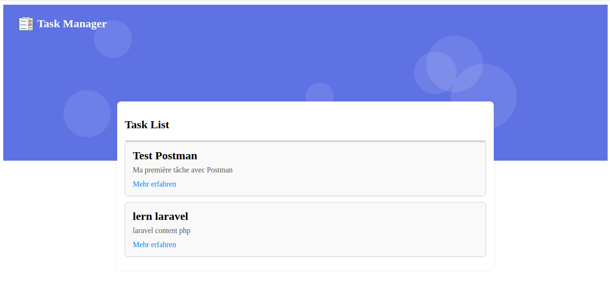

# 📝 Task Manager App

A simple task management application built with **Laravel (REST API)** and **React (frontend)**.

---

## Preview



---

## ✨ Features

### ✅ Backend API (Laravel)

- Create / Read tasks
- JSON API structure
- Feature tested with PHPUnit
- Database (SQLite)

### 🖥️ Frontend (React)

- Display task list
- Form to create a new task
- Fetch data from the API

---

## 📦 Installation

### 1. Clone the repo

```bash
git clone https://github.com/lemael/taskmanager_laravel.git
cd taskmanager_laravel
```
